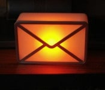

Dream Cheeky WebMail Notifier
=============================

Shell scripts to control the [Dream Cheeky WebMail Notifier](https://web.archive.org/web/20130701042120/http://dreamcheeky.com/webmail-notifier) or [getDigital USB Mail Melder](https://www.getdigital.de/pages/offlineprodukt/usb-mail-melder).




The scripts use the [kernel subsystem](https://www.kernel.org/doc/html/latest/subsystem-apis.html) device files as described in [LED handling under Linux](https://www.kernel.org/doc/html/latest/leds/leds-class.html).

Successfully tested on [openSUSE Tumbleweed](https://get.opensuse.org/tumbleweed/) and on [Raspbian GNU/Linux 12 (bookworm)](https://www.raspberrypi.com/software/).

See also [WebMail Notifier Linux driver (Dream Cheeky)](https://github.com/danielkaefer/usblamp) for a more complete solution.

&#160;

sh-dream-cheeky
---------------

Shell script to test the device. If a device is found, it will light up in red, green and blue.

```
$ sudo sh-dream-cheeky

💡 device found /sys/class/leds/dream_cheeky
🚥 running test .... done
```

&#160;

sh-dream-checky
---------------

Shell script to check for emails and control of the USB lamp. It uses sh-dream-cheeky.

```
$ sudo sh-dream-checky

💡 device found /sys/class/leds/dream_cheeky
📨 25174 total messages, 3 unseen, 0 recent
```

&#160;

mail.conf
---------------
Imap script to login and check for emails. Copy the file to /etc and put in your email and password.

For Google Mail [create and manage your app passwords](https://myaccount.google.com/apppasswords).
See also [Bash script to check for new e-mails](https://stackoverflow.com/q/27134018).

&#160;
